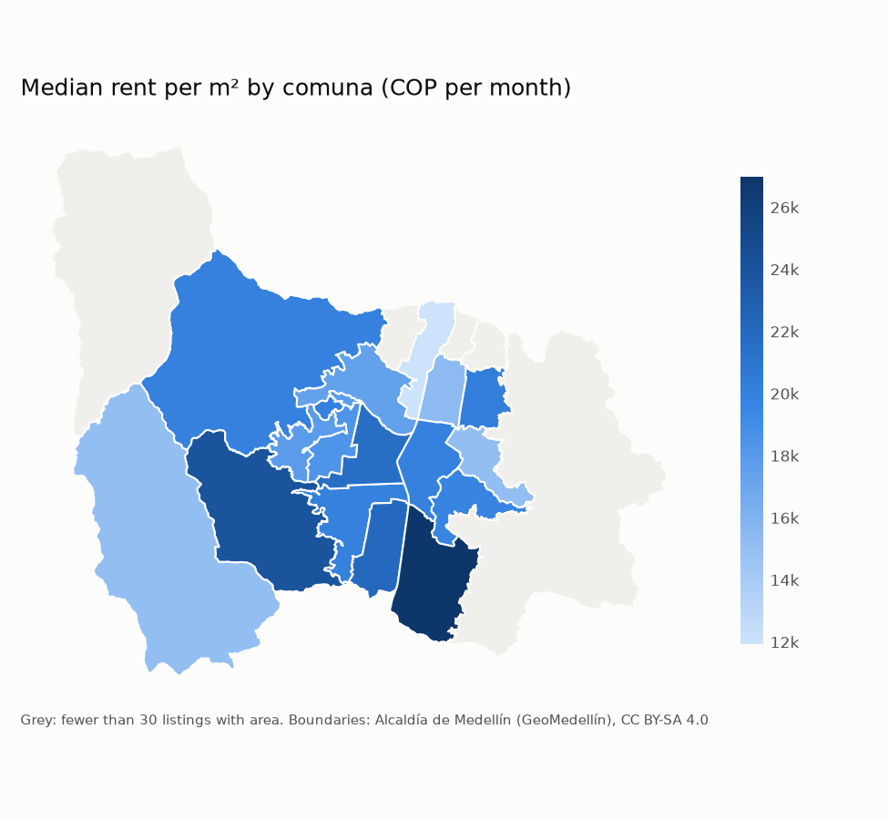
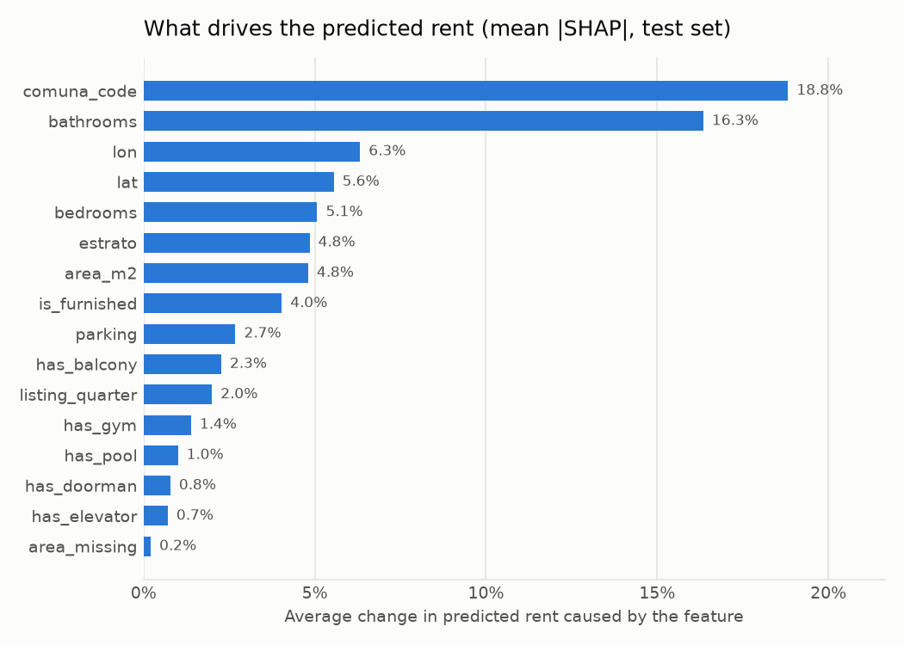

# Medellín Rent Predictor

[](https://github.com/RafaGM1108/medellin-rent-predictor/actions/workflows/ci.yml)
[](https://codecov.io/gh/RafaGM1108/medellin-rent-predictor)
[](https://www.python.org/)
[](LICENSE)

> Is this rent fair? Predicting and explaining monthly apartment rents in Medellín, Colombia.

## Overview

This project predicts the monthly rent (COP) of an apartment in Medellín from its
characteristics (comuna/barrio, estrato, area in m², rooms, bathrooms, parking, floor,
building age and amenities) and explains which of them drive the price. The model is served
through a FastAPI endpoint and a Streamlit app that answers one question: *is this listed
rent fair?*



*Median rent per m² by comuna, from `make analysis` (details in [docs/analysis.md](docs/analysis.md)). Boundaries: Alcaldía de Medellín (GeoMedellín), CC BY-SA 4.0.*

## Motivation

I'm moving into an unfurnished apartment in Medellín and wanted to know whether listed rents
are fair. Asking prices vary widely between comunas, estratos and buildings, and it is hard
to tell from a few listings whether a price is reasonable. A model trained on many listings,
with interpretable drivers, gives a reference price and the reasons behind it.

## Data

- **Rental listings.** Colombian real-estate portals are used **only** if their robots.txt
  and terms of use allow it, with rate limiting and an identified user agent; otherwise a
  public dataset of Medellín listings is used. No personal data is collected. The source
  survey and the decision are tracked in
  [#7](https://github.com/RafaGM1108/medellin-rent-predictor/issues/7).
- **Geographic layers.** Comunas and barrios boundaries from Medellín's official open data
  portal, used to map each listing to its comuna and to draw maps.

Sources, licenses and retrieval dates are documented in [`data/README.md`](data/README.md).
Data whose license forbids redistribution is not committed; only code and small samples are.

## Approach

The project follows a feature / training / inference (FTI) pipeline architecture.

1. **Acquisition.** A scraper or loader in `src/` stores listings and boundaries unchanged in
   `data/01_raw/`.
2. **Cleaning and validation.** Listings are parsed, validated with pandera schemas, mapped
   from barrio to comuna and cleaned of duplicates and outliers (`02_intermediate`,
   `03_primary`).
3. **Exploration and statistics.** Rent per m² by comuna and estrato, an interactive map and
   hypothesis tests (e.g. the effect of parking and estrato on price).
4. **Feature pipeline.** Reusable feature functions build `04_feature` and `05_model_input`.
5. **Training pipeline.** A baseline (median by comuna), Ridge, Random Forest and LightGBM
   are compared with k-fold cross-validation and tracked in MLflow; the best model is
   interpreted with SHAP. Metrics and figures are saved to `08_reporting`.
6. **Inference and serving.** An inference pipeline, a FastAPI `/predict` endpoint in a
   Docker image, and a Streamlit app deployed on Streamlit Community Cloud.

## Results

Every number and figure below comes from a file in
[`data/08_reporting/`](data/08_reporting/), produced by `make analysis`, `make train` and
`make interpret`. Details: [docs/models.md](docs/models.md) and
[docs/analysis.md](docs/analysis.md).

### Model comparison (5-fold cross-validation, 16,890 training listings)

| Model | MAE (COP) | RMSE (COP) | MAPE |
|-------|----------:|-----------:|-----:|
| **LightGBM** | **374,166** | **866,113** | **16.0%** |
| LightGBM + barrio target encoding | 380,277 | 875,058 | 16.4% |
| Random Forest | 399,000 | 920,036 | 17.0% |
| Ridge | 512,155 | 1,065,520 | 23.3% |
| Baseline (comuna median) | 646,954 | 1,292,196 | 29.8% |

Source: `model_comparison.csv`.

### Held-out test set (4,222 listings, LightGBM)

| MAE (COP) | RMSE (COP) | MAPE | 80% interval |
|----------:|-----------:|-----:|-------------:|
| 351,516 | 816,338 | 15.6% | prediction × 0.78 to × 1.26 |

Source: `test_metrics.json`. Prices are 2020-2021; the API and the app bring them to
September 2026 prices with DANE's CPI for rent (factor 1.325, `conf/rent_index.json`).

### What drives the rent



- **Location first**: the comuna changes the prediction by 18.8% on average, and the
  coordinates add 6.3% (longitude) and 5.6% (latitude) (`shap_importance.csv`).
- **Size through rooms**: bathrooms (16.3%) rank above area (4.8%) because area is missing
  for about two thirds of listings.
- **El Poblado** raises the prediction by 29.0% against the average listing
  (`shap_by_comuna.csv`); **estrato** adds up to about +7% (estrato 6) once location and size
  are known (`shap_by_estrato.csv`).

### Limitations

- **Old prices.** Listings are from July 2020 to August 2021. The adjustment to current prices
  uses one national rent index for the whole city.
- **Sparse fields.** Area is stated in only 34.5% of listings, floor and building age almost
  never; parking and amenities come from the listing text.
- **Asking prices, not contracts.** Listings show the rent asked, which may differ from the
  rent finally agreed.
- **Top of the market.** RMSE is more than twice the MAE: a few expensive listings have large
  errors.
- **Single source.** One portal's listings (Properati), whose license could not be verified,
  so the data is not redistributed.

## Project structure

```text
├── conf/base.yaml          # Paths and parameters
├── data/
│   ├── 01_raw/
│   │   ├── listings/       # Rental listings as acquired (immutable)
│   │   └── geo/            # Comunas/barrios boundaries from Medellín open data
│   ├── 02_intermediate/ … 07_model_output/
│   └── 08_reporting/       # Metrics (JSON/CSV) and figures (PNG) behind the Results
├── docs/                   # MkDocs Material site
├── src/medellin_rent/
│   ├── data/               # Listings acquisition (scraper or loader) and cleaning
│   ├── geo/                # Boundaries loading and barrio → comuna mapping
│   ├── analysis/           # Reproducible analyses (make analysis)
│   ├── features/           # Feature engineering
│   ├── model/              # Training and evaluation
│   ├── inference/          # Prediction logic
│   ├── pipelines/          # feature_pipeline, training_pipeline, inference_pipeline
│   ├── api/                # FastAPI service
│   ├── app/                # Streamlit app ("Is this rent fair?")
│   └── utils/              # Config loader and logging
├── tests/                  # Mirrors src/
├── Dockerfile              # Multi-stage image for the API
└── Makefile                # Common commands (make help)
```

### Adaptation from the template

This repo was created from
[ds-project-template](https://github.com/RafaGM1108/ds-project-template). The layout was
adapted to the two kinds of data this project combines:

- **`data/01_raw/` is split into `listings/` and `geo/`.** Listings and geographic
  boundaries come from different sources, with different licenses, formats and refresh
  cycles, so each keeps its own raw folder. Both are set in `conf/base.yaml`
  (`paths.raw_listings`, `paths.raw_geo`).
- **New `src/medellin_rent/geo/` module** (tested in `tests/geo/`). Loading the official
  comunas/barrios boundaries and mapping each listing's barrio to its comuna is spatial
  logic used by both the cleaning stage and the app, so it lives apart from `data/`.
- **`src/medellin_rent/data/`** holds the listings acquisition module (scraper or loader,
  decided in Phase 1 after checking robots.txt and terms of use) and the cleaning code.

- **No notebooks.** The template's `notebooks/` folder was removed: every analysis is a
  script in `src/` run with `make`, so figures and tables in `data/08_reporting/` can be
  regenerated from the data at any time.

Everything else follows the template: the layered data folders and FTI pipelines.

## Quickstart

Requires [uv](https://docs.astral.sh/uv/) and `make`.

```bash
git clone https://github.com/RafaGM1108/medellin-rent-predictor.git
cd medellin-rent-predictor
make install                 # dependencies + pre-commit hooks
cp .env.example .env         # then fill in secrets, if any
make lint typecheck test     # check everything works
```

| Command | What it does |
|---------|--------------|
| `make geo` | Download comuna, barrio and estrato layers into `data/01_raw/geo/` |
| `make listings` | Check the manually downloaded listings file and record its checksum |
| `make prices` | Download DANE's rent CPI and write `conf/rent_index.json` (adjustment to current prices) |
| `make feature` / `make train` | Run the feature and training pipelines |
| `make infer` | Price the listings in `data/01_raw/new_listings_sample.csv` (or any CSV in that format) into `data/07_model_output/predictions.csv` |
| `make analysis` | Regenerate the analysis figures and tables in `data/08_reporting/` |
| `make interpret` | Explain the saved model with SHAP (figures and tables in `data/08_reporting/`) |
| `uv run mlflow ui --backend-store-uri sqlite:///mlruns/mlflow.db` | Browse the training runs |
| `make api` | FastAPI on http://localhost:8000 (docs at `/docs`) |
| `make app` | Streamlit app "Is this rent fair?" on http://localhost:8501 (needs a trained model) |
| `make coverage` | Tests with an HTML coverage report |
| `make docs` | Serve the documentation locally |

API (needs a trained model, `make train`):

```bash
make api
curl -X POST localhost:8000/predict -H 'content-type: application/json' \
  -d '{"comuna": "EL POBLADO", "estrato": 5, "area_m2": 80, "bedrooms": 2, "parking": "yes"}'
```

Only `comuna` is required (official name, see `/docs`); the response has the predicted
monthly rent in COP at current prices (`prices_as_of`, adjusted with DANE's rent CPI), an
80% interval, the adjustment applied and the prediction at 2020-2021 prices.

Online app (Streamlit Community Cloud): the trained model is not in git, so the app
downloads `model.joblib` and `model_metadata.json` from the GitHub release set in
`params.model_release_url` the first time it starts. Dependencies come from
`requirements.txt`, exported from `uv.lock` (a pre-commit hook keeps it in sync).

Docker (API):

```bash
docker build -t medellin-rent-predictor .
docker run --rm -p 8000:8000 \
  -v "$PWD/data/06_models:/app/data/06_models:ro" medellin-rent-predictor
```

## Roadmap

| Phase | Milestone | Scope | Status |
|-------|-----------|-------|--------|
| 0 | [Phase 0 - Setup](https://github.com/RafaGM1108/medellin-rent-predictor/milestone/1) | Repo, issues, Kanban board, CI green | ✅ Done |
| 1 | [Phase 1 - Data acquisition](https://github.com/RafaGM1108/medellin-rent-predictor/milestone/2) | Acquisition module (scraper or loader) with tests; raw data; source documentation | ✅ Done |
| 2 | [Phase 2 - Cleaning and validation](https://github.com/RafaGM1108/medellin-rent-predictor/milestone/3) | Pandera schemas, barrio → comuna mapping, outlier handling | ✅ Done |
| 3 | [Phase 3 - EDA and statistical analysis](https://github.com/RafaGM1108/medellin-rent-predictor/milestone/4) | Price per m² by comuna and estrato, interactive map, hypothesis tests | ✅ Done |
| 4 | [Phase 4 - Feature pipeline](https://github.com/RafaGM1108/medellin-rent-predictor/milestone/5) | Feature engineering and the feature pipeline | ✅ Done |
| 5 | [Phase 5 - Training](https://github.com/RafaGM1108/medellin-rent-predictor/milestone/6) | Baseline, Ridge, Random Forest, LightGBM; k-fold CV; MLflow; SHAP | ✅ Done |
| 6 | [Phase 6 - Inference and API](https://github.com/RafaGM1108/medellin-rent-predictor/milestone/7) | Inference pipeline, FastAPI endpoint, Docker image | 🟡 In progress |
| 7 | [Phase 7 - App and release](https://github.com/RafaGM1108/medellin-rent-predictor/milestone/8) | Streamlit app on Streamlit Community Cloud, README results, `v1.0.0` | ⬜ |

## Project management

Work is planned and tracked on a public Kanban board:
**[medellin-rent-predictor · Kanban](https://github.com/users/RafaGM1108/projects/11)**.

- **Columns:** Backlog → Ready → In Progress → In Review → Done, with at most 2 items
  In Progress at a time.
- **Milestones:** each roadmap phase is a milestone (`Phase N - <name>`) broken into small
  issues of half a day to two days of work.
- **Issues:** each has a description, an acceptance criteria checklist, a type label
  (`type:feat`, `type:data`, `type:analysis`, `type:model`, `type:docs`, `type:test`,
  `type:ci`, `type:bug`), a milestone, and **Priority** (High/Medium/Low) and **Size**
  (S/M/L) fields on the board.
- **Flow:** one issue → one branch (`<type>/<issue>-<slug>`) → one PR that says
  `Closes #<issue>`. `main` is protected: PRs need the CI check to pass and are merged with a
  merge commit, so every commit is kept. Work found along the way becomes a new Backlog issue.
- **Changes** are recorded in [`CHANGELOG.md`](CHANGELOG.md); phases that ship a release are
  tagged.

## Tech stack

| Area | Tools |
|------|-------|
| Data | pandas, pandera, geopandas |
| Modelling | scikit-learn, LightGBM, SHAP, MLflow |
| Visualisation | plotly, folium |
| Serving | FastAPI, Docker, Streamlit (Community Cloud) |
| Engineering | Python 3.12, uv, ruff, mypy, bandit, pytest, pre-commit, GitHub Actions, Codecov, MkDocs Material |

Libraries are added with `uv add` in the phase that first needs them.

## Author

**Rafael E. Garcia**

- GitHub: [@RafaGM1108](https://github.com/RafaGM1108)
- LinkedIn: [linkedin.com/in/rafaelgarcia11](https://www.linkedin.com/in/rafaelgarcia11)

Licensed under the [MIT License](LICENSE).
